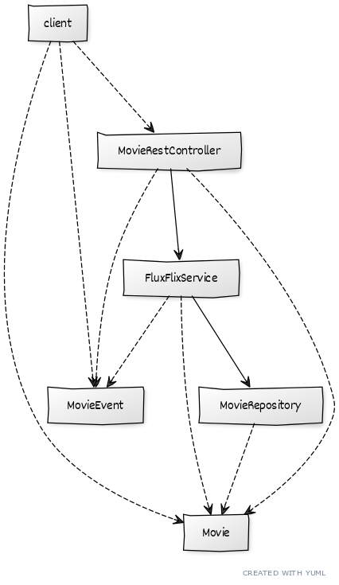
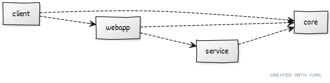

# Spring Boot Multi-Module Project
This project decouples an application in several modules. This is based on several tutorials ([1](https://spring.io/guides/gs/multi-module/), [2](https://www.baeldung.com/spring-maven-bom), [3](https://www.baeldung.com/maven-multi-module) and [4](https://www.baeldung.com/spring-boot-multiple-modules)) and a [Spring reactive project](https://github.com/gabrielcostasilva/reactivity-examples/blob/main/flux-flix-service).

## Project Overview
Figure 1 shows classes and their relationships in our project.

<figure>
    
    <figcaption>Figure 1. Classes and their relationships.</figcaption>
</figure>

`MovieRestController` provides users access to `FluxFlixService` services, which in turn, uses `MovieRepository` to save and retrieve `Movie` data. `client` represents a class that implements a _WebClient_. The _WebClient_ accesses `Movie` and `MovieEvent` data through `REST` calls to `MovieRestController` provided endpoint. One can notice that `Movie` and `MovieEvent` classes are used by every other class in the project. 

A multi-module project helps decoupling an application into manageable modules. Figure 2 below shows the resulting modules and their dependencies. Note that `client` does not _really_ depend on `webapp`, but `client` accesses `webapp` through `REST` calls.

<figure>
    
    <figcaption>Figure 2. Classes and their relationships.</figcaption>
</figure>


## Decopling Process

### SETTING THE PARENT PROJECT
First, we started by creating a parent project. The parent project consists of a single `pom.xml` that declares common dependencies and groups subprojects. The code below shows the central part of the parent `pom.xml`.

```
<parent> <!-- (1) -->
    <groupId>org.springframework.boot</groupId>
    <artifactId>spring-boot-starter-parent</artifactId>
    <version>2.6.2</version>
    <relativePath/> 
</parent>

<groupId>com.example</groupId>
<artifactId>parent-project</artifactId>
<version>0.1.0</version>
<packaging>pom</packaging> <!-- (2) -->

<modules> <!-- (3) -->
    <module>core</module>
    <module>service</module>
    <module>webapp</module>
    <module>client</module>
</modules>
```
1. Declares a parent project for the parent project. Although it may seem confusing, Spring Boot projects inherit from `spring-boot-starter-parent`. As this is a Spring Boot project, all submodules would inherit from `spring-boot-starter-parent`. As the super module, the parent module of this project, already inherits from Spring Boot, the other modules do not need to repeat this.

2. Defines that this project is a parent project.

3. Lists the submodules. Thanks to this list, the parent project is able to manage submodules by setting their proper build order.

### SETTING THE `core` MODULE
As Figure 1 shows, `Movie` and `MovieEvent` are shared amongst all other classes. Therefore, the `core` module groups these two classes as a single transveral dependency. 

We explicit set the parent project in the `core` project `pom.xml`, as the code below presents.

```
<parent>
    <artifactId>parent-project</artifactId>
    <groupId>com.example</groupId>
    <version>0.1.0</version>
</parent>
```

Notice that this project has its own identity, including specific dependencies as the `pom.xml` snippet below shows.

```
(...)
<groupId>com.example</groupId>
<artifactId>core</artifactId>
<version>1.0-SNAPSHOT</version>
<packaging>jar</packaging>
(...)

<dependencies>
    <dependency>
        <groupId>org.springframework.boot</groupId>
        <artifactId>spring-boot-starter-data-mongodb</artifactId>
    </dependency>
</dependencies>
```
Observe the dependency of `spring-boot-starter-data-mongodb`, the `Movie` class represents a persistent MongoDB entity. Also note this project is packaged as a `jar` instead of parent's `pom` packaging.

**Before start using the `core` module, one should run `mvn install` in the parent project so that the dependency becomes locally available.**

### SETTING THE `service` MODULE
The `service` module is responsible for grouping `MovieRepository` and `FluxFlixService`. These classes are tightly coupled as `FluxFlixService` acts as a public API for users to access `Movie` data managed by the `MovieRepository` implementation.

Notice that both classes in this module depend on the `core` module. Therefore, we added the `core` module as a dependency for this project, as the code below shows.

```
<dependencies>
    <dependency>
        <groupId>com.example</groupId>
        <artifactId>core</artifactId> <!-- Groups Movie and MovieEvent -->
        <version>1.0-SNAPSHOT</version>
    </dependency>

    <dependency>
        <groupId>org.springframework.boot</groupId>
        <artifactId>spring-boot-starter-data-mongodb-reactive</artifactId>
    </dependency>

    <dependency>
        <groupId>org.springframework.boot</groupId>
        <artifactId>spring-boot-starter-webflux</artifactId>
    </dependency>

    <dependency>
        <groupId>org.projectlombok</groupId>
        <artifactId>lombok</artifactId>
    </dependency>
</dependencies>
```
The code above also shows other dependencies that `service` classes use. The parent project and the `service` project identification must follow the same principles used in the `core` module.

As `Movie` and `MovieEvent` are part of the `core` module, the imports must use the structure in these projects. See the example of `MovieRepository` below.

```
package com.example.service;

import org.springframework.data.mongodb.repository.ReactiveMongoRepository;

import com.example.core.Movie; // (1)

public interface MovieRepository extends ReactiveMongoRepository<Movie, String>{}
```

1. The import uses the folder structure set in the `core` module.

### SETTING THE `webapp` and `client` MODULES
The `webapp` module groups the REST controller and a class that is responsible for populating the database with initial data.

Like the two previous modules, this module must set the parent project, its own identity, and its dependencies. In this case, the only dependency is the `service` module. Dependencies are transitive. Therefore, by importing the `service` module, we also import the `core` module.

However, unlike the two previous modules, this module must create an executable `jar`. Therefore, we need to add the Spring Boot plugin responsible for that, as the code below shows.

```
(...)
<build>
    <plugins>
        <plugin>
        <groupId>org.springframework.boot</groupId>
        <artifactId>spring-boot-maven-plugin</artifactId>
        (...)
        </plugin>
    </plugins>
</build>
(...)
```

The `client` module follows the same principles of `webapp` module, apart from the dependencies it uses. The `client` modules **does not directly depends on** `service`, but it accesses `service` methods by REST calls exposed by the `webapp` module. 

However, as Figure 1 shows, the `client` depends on `Movie` and `MovieEvent` classes, in the `core` module. Therefore, the `core` module must be explicitly listed in the `client` `pom.xml` dependencies section. In addition, the `client` modules also depends on `spring-boot-starter-webflux` dependency for the `WebClient`.

## Running the Project Locally
To run this project, you must have MongoDB running in the default port and Java 17 or later.

1. Clone the project locally

```
git clone https://github.com/gabrielcostasilva/sb-multi-module-project.git
```

2. In the `sb-multi-module-project` folder, run

```
mvn package
```

3. Run the `webapp` project

```
java -jar webapp/target/webapp-1.0-SNAPSHOT.jar
```

4. You can test by using a HTTP client, such as [HTTPie](https://httpie.io)

```
http localhost:8080/movies
```

5. You can run the `client` project

```
java -jar client/target/client-1.0-SNAPSHOT.jar
```
